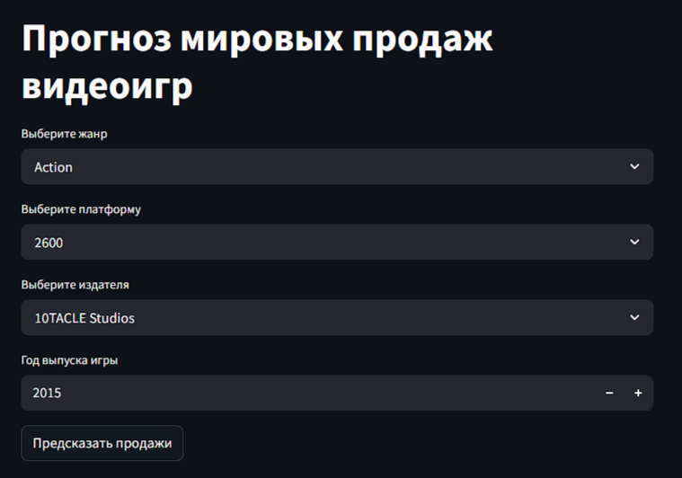
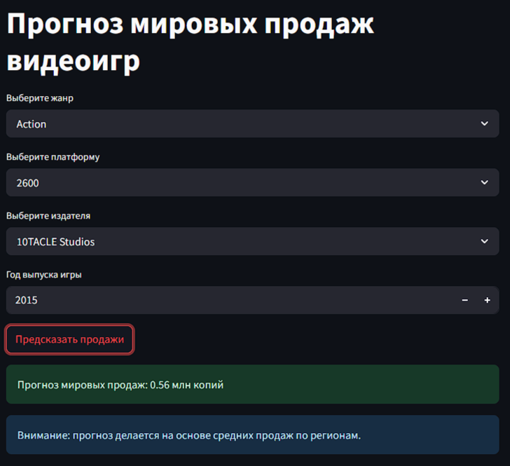

# 🎮 Game Sales Predictor

## 📚 Описание проекта
Этот проект направлен на прогнозирование мировых продаж видеоигр на основе характеристик игры: жанра, платформы, издателя и года выпуска.

Была разработана модель машинного обучения на алгоритме XGBoost с высокой точностью.  
Для демонстрации возможностей модели было создано удобное веб-приложение на Streamlit.

---

## 🛠 Используемые технологии
- Python 3.10
- Pandas, NumPy
- Scikit-learn
- XGBoost
- Matplotlib, Seaborn
- Streamlit

---

## 🧩 Этапы проекта
- Загрузка и предобработка данных
- Исследовательский анализ данных (EDA)
- Фичеинжиниринг (создание признаков, кодирование категориальных признаков)
- Обучение модели XGBoost
- Гиперпараметрическая оптимизация
- Кросс-валидация модели
- Разработка веб-приложения на Streamlit

---

## 🎯 Краткие результаты
- Среднеквадратичная ошибка (MSE): **0.84**
- Коэффициент детерминации (R²) на тестовой выборке: **0.80**
- Среднее значение R² на кросс-валидации: **0.92**

---

## 🚀 Как запустить проект

1. Клонируйте репозиторий:

bash
git clone https://github.com/ВАШ-ГИТХАБ/Game-Sales-Predictor.git
cd Game-Sales-Predictor

2. Установите зависимости:
bash
pip install -r requirements.txt

3. Запустите Streamlit-приложение:
bash
streamlit run app.py

## 📷 Скриншоты интерфейса

### Главная страница

### Прогноз продаж

## 📌 Возможности для развития проекта
- Подстановка средних продаж в зависимости от жанра и платформы
- Добавление дополнительных признаков (оценки игроков, рекламные бюджеты)
- Улучшение обработки пропущенных данных
- Углубленная оптимизация гиперпараметров

## 📂 Структура проекта
/Game-Sales-Predictor
│
├── app.py                  # Streamlit приложение
├── model_training.ipynb    # Jupyter ноутбук обучения модели
├── xgb_model.pkl           # Сохранённая обученная модель
├── scaler.pkl              # Сохранённый стандартизатор
├── label_encoders.pkl      # Сохранённые LabelEncoders
├── video games sales.csv   # Датасет
├── README.md               # Описание проекта
├── requirements.txt        # Файл зависимостей
└── /images
     ├── main_page.png
     ├── prediction_result.png

## 👨‍💻 Автор проекта
- **Nikolay Lyashenko** | [GitHub профиль](https://github.com/Dark1Loki)
